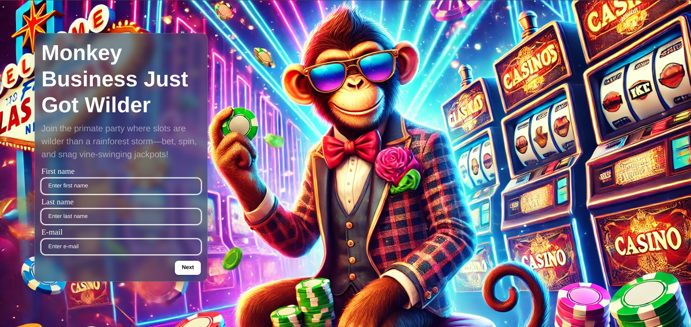

# Monkey Casino Experience
---

## Description

**Monkey Casino Experience** is a React-based application designed to deliver an engaging casino interface. The project focuses on implementing a two-step registration form and a dynamic games section (lobby) while adhering to the client's requirements for a "monkey-themed" casino. The design uses vibrant colors and humorous imagery to reflect the client's preferences.

--- 
## Features

### Registration Form

- **Two-step form** with fields such as First Name, Last Name, Email, Username, Password, Confirm Password, and Terms & Conditions.
- **Dynamic field rendering** based on JSON configuration.
- **Field validation** using React Hook Form.
- **Step validation**: Prevent navigation to the next step until all fields in the current step are valid.
- **Redirection**: On successful registration, users are redirected to the games section.

### Games Section (Lobby)

- **Game Categories Navigation**:
    - Displays categories, subcategories, tags dynamically based on available data.
- **Games Grid**:
    - Shows game thumbnails.
    - Displays titles and provider names on hover.
- **Search Functionality**:
    - Enables search by game name or provider.
- **Infinite Loading**:
    - Implements seamless loading of additional games.
- **Advanced Filters**:
    - Includes a modal with detailed search and filtering options.

---
## Technologies Used

- **Framework**: React with Vite.
- **Styling**: Bootstrap and custom CSS.
- **Form Handling**: React Hook Form.
- **State Management**: Redux.
- **Dynamic Field Rendering**: JSON-based configuration.

---
## Folder Structure

- 📁 API
    - 📁 services // API services for different endpoints
    - 📄 apiCall.js // Dynamic function for API calls
    - 📄 config.ts // API configuration

- 📁 ASSETS // Images and other static assets

- 📁 COMPONENTS
    - 📁 layouts // Reusable layout components
    - 📁 ui // UI components such as buttons, modals

- 📁 CONFIG // Application-wide configurations

- 📁 HOOKS // Custom hooks for shared logic

- 📁 PAGES
    - 📁 HomePage
        - 📁 hooks // Page-specific hooks
        - 📁 components // Page-specific components
        - 📄 HomePage.jsx // Home page component
    - 📁 LoginPage
        - 📁 components // Page-specific components
        - 📄 LoginPage.jsx // Login page component

- 📁 ROUTES
    - 📄 routes.js // Application routes

- 📁 SCHEMAS
    - 📄 validation.js // Form validation schemas

- 📁 STORE // Redux State management store
    - 📁 Reducers // Reducers for different slices of state
    - 📁 Selectors // Selectors for accessing state and functions for memoization

- 📁 STYLE
    - 📁 abstracts // Variables, mixins, and other SCSS abstracts
    - 📁 base // Base styles (resets, typography, etc.)
    - 📁 components // Component-specific styles
    - 📁 layouts // Layout-specific styles
    - 📁 pages // Page-specific styles
    - 📄 index.css // Global stylesheet

- 📁 UTILS // Utility files with functions and constants

---
## How to Run the Project

1. **Clone the repository**:

<b>git clone <IGP-form></b>

2. **Navigate to the project directory:**

<bold>cd IGP-form</bold>

3. **Install dependencies:**

<b>npm install or npm install --legacy-peer-deps </bold>

4. **Start the development server:**

<b>npm run dev</b>
